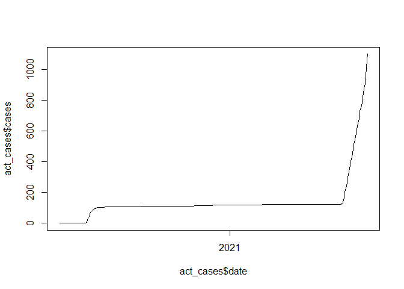

<!-- README.md is generated from README.Rmd. Please edit that file -->

# covidau

<!-- badges: start -->

[](https://github.com/bryceroney/covidau/actions)
<!-- badges: end -->

This is a bit of a playground for me to learn building packages. At the
moment it just contains one function, `cases` for loading cases.

## Example:

``` r
library(covidau)

act_cases <- cases('ACT')
head(act_cases)
#> # A tibble: 6 x 6
#>   date         new cases   var   net state
#>   <date>     <dbl> <dbl> <dbl> <dbl> <chr>
#> 1 2021-10-03    38  1101    NA    38 ACT  
#> 2 2021-10-02    52  1063    NA    52 ACT  
#> 3 2021-10-01    52  1011    NA    52 ACT  
#> 4 2021-09-30    31   959    NA    31 ACT  
#> 5 2021-09-29    22   928    NA    22 ACT  
#> 6 2021-09-28    13   906    NA    13 ACT

plot(act_cases$date, act_cases$cases, type='line')
#> Warning in plot.xy(xy, type, ...): plot type 'line' will be truncated to first
#> character
```


